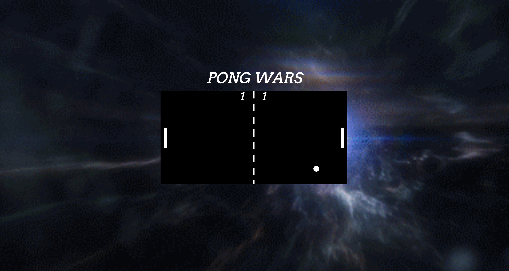

# Pong Wars

A pong game made using SVGs.

## Setup

**Install:**

`> npm i`

**Run:**

`> npm start`

## Keys

**Player 1:**
* a: up
* z: down

**Player 2:**
* ▲ : up
* ▼: down

## Motivation
Pong Wars was created as a requirement for project 3 at RED Academy 

## Key Takeaways
The main motivation behind the creation of this website was to become more familiar using Webpack for running build tasks, how to build svgs using javascript. These goals were achieved through the creation of Pong Wars. As can be seen through out the code, many different techniques, properties, and organizations were used.

## Technologies Used
The site was designed using Visual Studio Code. Many references were made to Mozilla Developer Network, Stack Overflow, RED resources, and others. 

## Included
index.html
bundle.js
*this* README.md
all font resources
all images used

## Contributors
Montana Sawyer